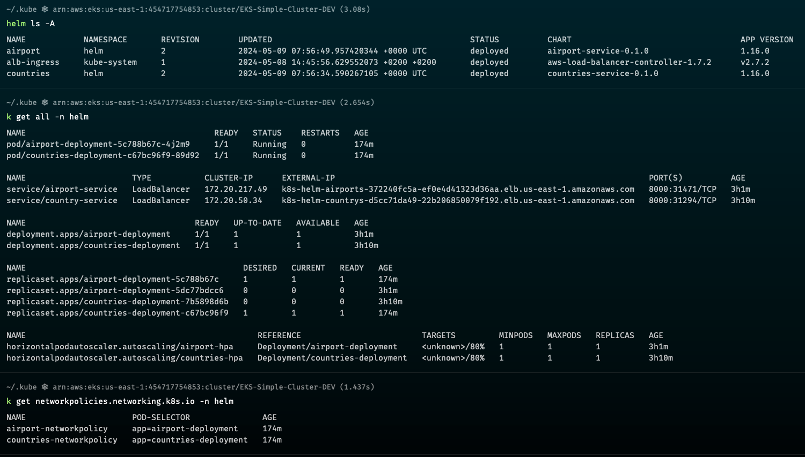
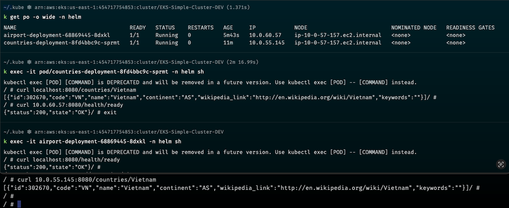
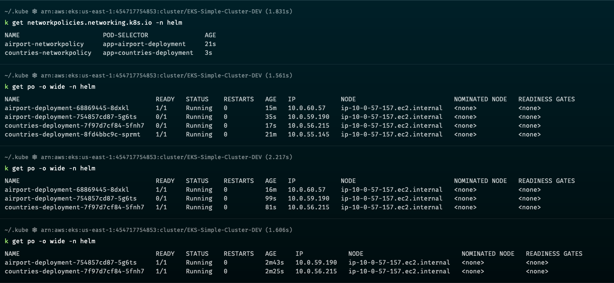
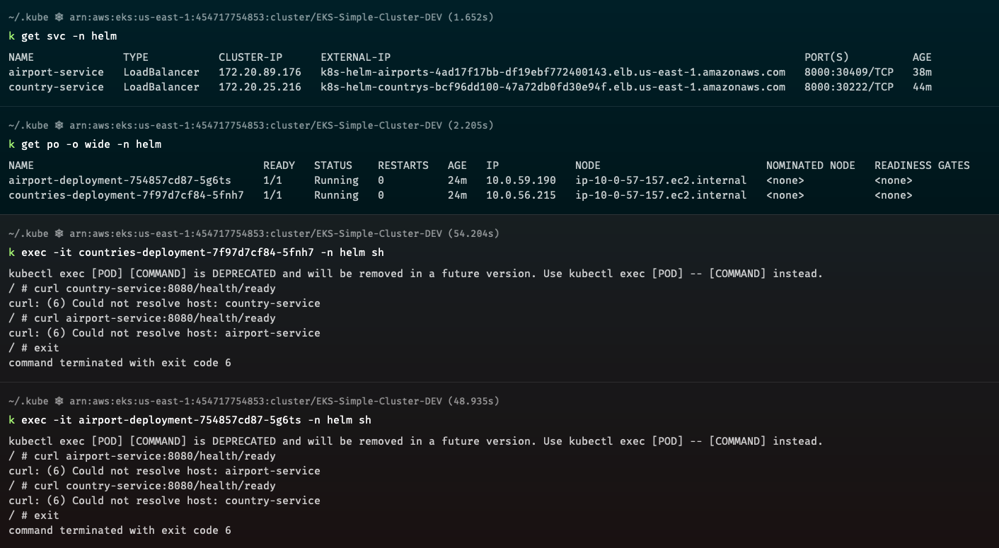

# VIwell Country Service

In this repo i used:
- `Helm-Deploy` directory to deploy country service as a Helm chart 
- `manifest`directory to deploy it as a normal k8s manifest
- GitHub Actions as a CI/CD

1- Using Helm chart:
- At first i created helm-deploy/templates/networkpolicy.yaml to make the service isolated and didn't accept traffic just only from its internal LoadBalancer
- Update `Chart.yaml`, `values.yaml` and `helm-deploy/templates manifest` variables

2- Create CI/CD using GitHub Actions to Build and Deploy our service on EKS Cluster.

3- helm chart resources: 

4- Trying to access pods without networkpolicy:

  - curl form countries service to airport ===> works
  - curl from airport service to countries ===> works
  

5- Manifests after fake push to build the pipline to apply the networkpolicies 

***Note: Update at the code review without causing a service interruption.***

6- Trying to access pods again:

  - curl form countries service to airport ===> failed
  - curl form countries service to airport ===> failed

5- Trying to access pods again but this time from EC2 at the same cluster vpc using the `internal loadbalncer`

  - curl form countries service to airport ===> works
  - curl form countries service to airport ===> works

